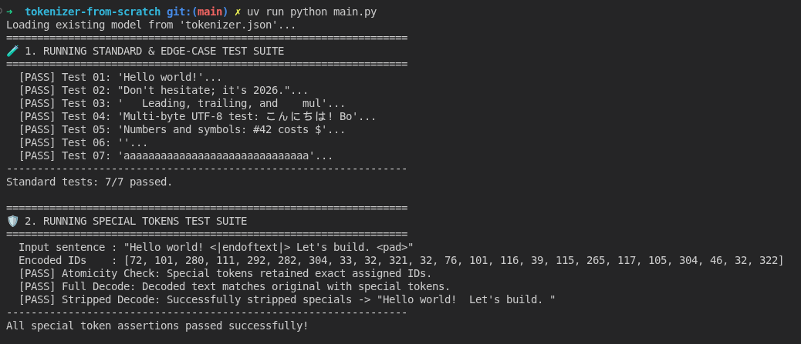
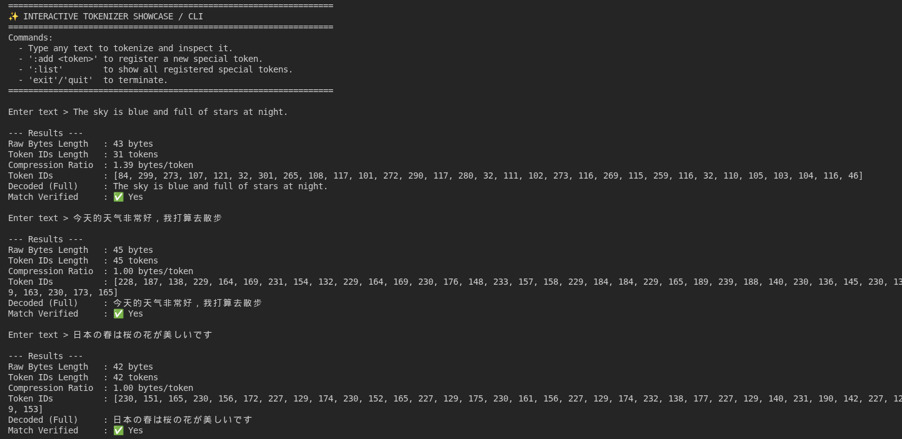

# 🪙 tokenizer-from-scratch

A production-grade, zero-dependency implementation of a **Byte-Level Byte-Pair Encoding (BPE) Tokenizer** built from first principles in Python.

Inspired by the architectures of modern LLM tokenizers (GPT-4, LLaMA 3, Mistral), this project demonstrates how raw bytes are isolated via regex firewalls, statistically merged into subwords, shielded against special-token injection, and serialized into a standalone `tokenizer.json`.

---

## ✨ Key Features

- **Pure Byte-Level Encoding**: Base vocabulary of 256 raw bytes (`0x00` - `0xFF`). Mathematically zero Out-Of-Vocabulary (`<unk>`) errors.
- **Atomic Special Tokens**: First-class support for control tokens (`<|endoftext|>`, `<pad>`, `<|im_start|>`) with regex-interception guarantees—they are never split or merged.
- **Prompt-Injection Guard (`allowed_special`)**: Configurable control over which special tokens are parsed versus treated as raw text.
- **Regex Boundary Firewalls**: GPT-style chunking isolates punctuation, contractions, numbers, and whitespace runs before subword merging.
- **O(k) Priority-Rank Subword Encoding**: Fast inference that evaluates only candidate pairs within slices, avoiding costly linear scans over the entire merge table.
- **Deterministic Tie-Breaking**: Lexicographical pair comparisons guarantee 100% reproducible vocabularies across machines.
- **Lossless Invertibility**: Guarantees `decode(encode(text)) == text` across arbitrary Unicode, emojis, and control characters.
- **Standalone JSON Persistence**: Exports and loads the entire state (metadata, merges, vocabulary, and special tokens) to/from `tokenizer.json`.

---

## 🏗️ Architecture & Pipeline

```
Raw Input Text
   │
   ▼
[ Special Token Interception ] --> Extracts allowed special tokens atomically
   │
   ├──────► Special Token Segment      --> Direct Reserved ID Lookup
   │
   └──────► Normal Text Segment         --> [ PreTokenizer Regex Firewall ]
                                                  │
                                                  ▼
                                            [ Raw UTF-8 Byte Tuples (0–255) ]
                                                  │
                                                  ▼
                                            [ Priority-Ranked BPE Merge ]
   │
   ▼
[ Concatenated Token IDs ]
```

---

## 📁 Project Structure

```
tokenizer-from-scratch/
├── assets/
│   ├── test_suite.png    # Automated tests output screenshot
│   └── cli_showcase.png  # Interactive CLI demonstration screenshot
├── vocabulary.py         # Base 256-byte mappings, token registration, and UTF-8 decoding
├── pre_tokenizer.py      # GPT-style regex pattern slicer and chunk frequency counter
├── tokenizer.py          # BPE trainer, special tokens interceptor, priority merger, and JSON I/O
├── main.py               # Automated edge-case test suite and Interactive CLI Showcase
└── README.md
```

---

## 🚀 Quick Start

### 1. Installation

Clone the repository and install the regex library:

```bash
git clone https://github.com/your-username/tokenizer-from-scratch.git
cd tokenizer-from-scratch
pip install regex
```

### 2. Basic Usage

```python
from tokenizer import Tokenizer

# Initialize
tok = Tokenizer()

# 1. Train on raw corpus
corpus = """
Byte-Pair Encoding (BPE) is a subword tokenization algorithm.
It merges frequent byte pairs iteratively without shredding contractions like it's or don't.
"""
tok.train(corpus, target_vocab_size=320)

# 2. Register Special Tokens
tok.register_special_token("<|endoftext|>")
tok.register_special_token("<pad>")

# 3. Encode (with atomic special tokens handling)
text = "Learning BPE! <|endoftext|>"
ids = tok.encode(text, allowed_special="all")
print("Token IDs:", ids)

# 4. Decode (with or without special tokens)
print("Full Decoded:", tok.decode(ids, skip_special_tokens=False))
print("Stripped Decoded:", tok.decode(ids, skip_special_tokens=True))
```

---

## 🧪 Interactive Showcase & Test Suite

Run the bundled driver script to execute the unit test battery and launch the CLI:

```bash
python main.py
```

### 1. Automated Validation & Edge-Case Suite

The automated test runner validates standard sentences, contractions, multi-byte UTF-8 characters, numbers, empty strings, repetitive patterns, and special token atomicity.

<p align="center">
  
</p>

### 2. Interactive CLI Showcase

An interactive REPL environment that computes real-time compression ratios, inspects token sequences, detects special tokens, and enables dynamic token registration on the fly.

<p align="center">
  
</p>

### CLI Commands
Once in the interactive prompt, you can test arbitrary strings or manage special tokens on the fly:

- `:list` — Lists all currently registered special tokens and their assigned IDs.
- `:add <token>` — Registers a new special token dynamically (e.g., `:add <|im_start|>`).
- `exit` or `quit` — Exits the showcase.

---

## 🔬 Technical Deep Dive

1. **Initialization (Phase 1)**: Tokens `0..255` map directly to UTF-8 byte values `0x00..0xFF`.
2. **Pre-Tokenization (Phase 2)**: Text is partitioned via regex into contractions, alphabetic words (with optional leading spaces), digits, and punctuation. Merges are strictly forbidden from crossing chunk boundaries.
3. **Training Loop (Phase 3)**: In each step, all adjacent pairs are tallied across chunk frequencies. The most frequent pair (tie-broken lexicographically) is assigned a new ID (>= 256), and the chunks table is rewritten greedily left-to-right.
4. **Serialization (Phase 4)**: Merges and vocab are serialized to standard JSON without corrupting raw binary bytes.
5. **Inference (Phase 5)**: Incoming text is intercepted for special tokens, pre-tokenized, and merged using an $O(k)$ priority-rank lookup over present pairs.

---

## 📜 License
MIT License
